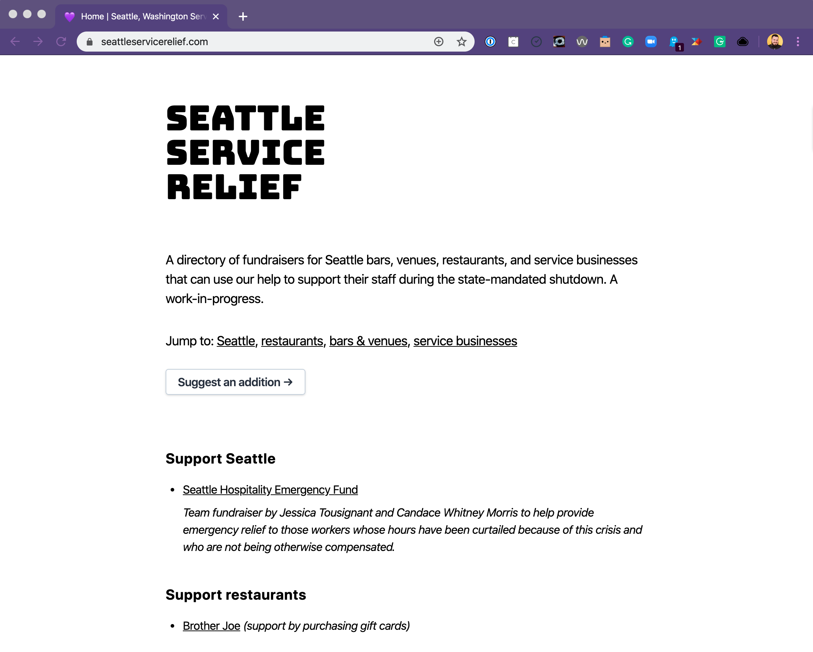
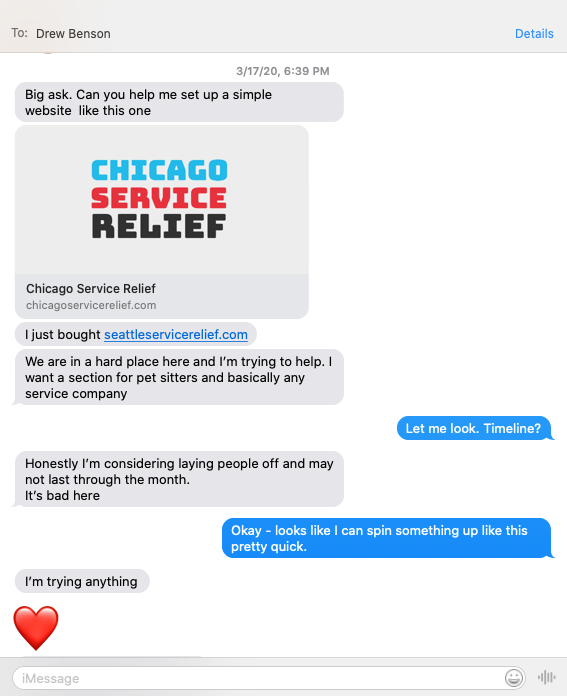
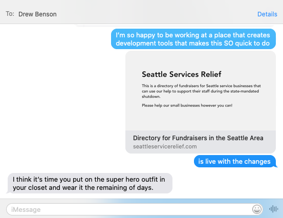

There is no doubt in my mind that we are living in unprecedented times. People, businesses, countries and world economies are all reeling from the fallout of the coronavirus pandemic sweeping the globe.

We woke up and the world was utterly changed. It's easy to be overwhelmed. I sat in my chair for an hour consuming story after story about how people were having their lives uprooted by something they could not control and I wanted desparately to help. But how?

State-mandated social distancing shutdowns are being rolled out across the country, closing down bars, entertainment venues, and restaurants - taking the livelihoods of countless service workers with them. "Shelter in place" orders also prevent independent workers like pet sitters and house cleaners from being able to do their jobs. And as independent small businesses classified as "nonessential," like bookstores and art galleries, are forced to close they also find themselves in the same increasingly dire situation.

Wonderfully, though, fundraisers are popping up all over the place to provide some emergency relief. Through them I saw a way to help out: creating a fast, free and above all easy way for communities to gather local relief fundraisers in a single website, where donors can easily find and contribute. It turns out I wasn't the only one with this idea!

**In this post:**

- [About the project](#about-the-project)
- [How it all began](#how-it-all-began)
- [Assembling a team](#assembling-a-team)
- [Building a prototype](#building-a-prototype)
- [How to Get Involved](#how-to-get-involved)

### About the project

The Service Relief Project is a boilerplate for launching blazing-fast zero-cost directories of local fundraisers to help your local businesses affected by mandated shutdowns around the world.

Here's what it does:

- Generates a static website using [Gatsby](https://gatsbyjs.org)
- Uses [Airtable](https://airtable.com) to manage your listings and categories
- Includes an Airtable form to collect local submissions and add them to Airtable for approval
- Can be personalized to a city or region without touching a line of code
- One-click deployment via Netlify

Using Gatsby to build and generate a static website based on data from a remote source like Airtable creates an ultra-fast website that can be hosted on any cloud infrastructure or hosted directly on a CDN. Because this project doesn't require a full CMS website it can handle spikes in traffic volume without slowing down or becoming inaccessible.

In order to provide the ability to launch a zero-cost directory of fundraisers for your local area, we've:

- Open-sourced the [entire project on GitHub](https://github.com/service-relief)
- Written [detailed instructions on how to get started](https://www.servicerelief.us/start/)
- Released a [Gatsby Starter](https://github.com/service-relief/gatsby-starter-service-relief) and a [Gatsby Theme](https://github.com/service-relief/service-relief/tree/master/themes/gatsby-theme-service-relief)
- Released a [one-click deployment to Netlify](https://app.netlify.com/start/deploy?repository=https://github.com/service-relief/gatsby-starter-service-relief)

_This project was inspired by [Chicago Service Relief](https://chicagoservicerelief.com/) and supported with the blessing of [Spencer Tweedy](https://twitter.com/spencertweedy/status/1239642482863935488)._

Here are a few of the sites that have already launched using this project:

- [Seattle Service Relief](https://seattleservicerelief.com/)
- [Denver Service Relief](https://denverservicerelief.com/)
- [Austin Service Relief](https://austinservicerelief.com/)
- [Sioux Falls Service Relief](https://siouxfallsservicerelief.com/)
- [Asheville Service Relief](https://ashevilleservicerelief.com/)

### How it all began

On Monday, March 16th, Gatsby made the decision to close down for two days. Even though we're a completely remote company, we chose to do this to give our team members the time they needed to care for their families and adjust to the new world we found ourselves in.

These are unprecedented times, and from my small home office in Omaha, Nebraska we didn't feel the ripples of what was to come. That eventing my phone vibrated, alerting me to a message from a close friend from Seattle, Washington. Things there were worse than I had imagined.

Drew and I have worked together in the past and I've both built and managed several websites for him over the years. All of them have been powered by [WordPress](https://wordpress.org), but I knew that spinning up another WordPress website was going to be overkill for something this simple.

That's where Gatsby came in. For the Seattle Service Relief site, I generated a new site using LekoArts' [Gatsby Minimal Blog](/starters/LekoArts/gatsby-starter-minimal-blog/) by running `gatsby new` and customizing a quick site. I had used the same starter on my personal site which helped speed up the process. A few hours later I messaged him back with a link to the live site.

That was Monday. All day Tuesday I kept pondering the Seattle Service Relief project and wondering if there might be something bigger that we could do with the website. Though a palpable feeling of uncertainty permeated any and all conversations with my fellow Gatsby-ites, there was also a chord strumming just loudly and universally with the desire to do something, anything to help as a company.

### Assembling a team

I am grateful to be surrounded by coworkers that are deeply passionate about helping others and, after a quick brainstorm with [Dustin Schau](https://twitter.com/SchauDustin) (Head of Product, Gatsby), I decided to float the idea in our **#random** Slack channel at work to see if anyone else was interested in helping out:

The response I recieved was incredible. Folks from every team at Gatsby chimed in with their support and stepping up to contribute. Within ten minutes team members purchased a half-dozen domain names for their own local areas and a dedicated Slack channel was created to house our internal discussion.

> "BTW - It's this stuff that makes me proud to work here!" - Jim Ettig, VP Sales

> "Also, mad love to the entire Gatsby team - I am so fortunate to work at a company that cares so much about giving back to the community! Let me help pay it forward 💜" - Armando Vasquez, Software Engineer

Inspired by the support, I built

### Building a prototype

At 6:30pm CST on March 18th, 8 members of the Gatsby team jumped on a Zoom call after-hours to discuss how we could help make this project a reality.

_A special thank-you to [Dustin Schau](https://twitter.com/SchauDustin), [Aisha Blake](https://twitter.com/AishaBlake), [Laurie Barth](https://twitter.com/laurieontech), [Amberley Romo](https://twitter.com/amber1ey), [Shane Thomas](https://twitter.com/smthomas3), [Kyle Gill](https://twitter.com/gill_kyle), [Nicole Tibaldi](https://twitter.com/nicoletibaldi), and [Jim Ettig](https://twitter.com/UncleJGE) for giving up your evening to make this a reality._

**We had a few key goals in mind:**

1. Anyone should be able to launch their own site, regardless of their technical proficiency
2. This meant that you shouldn't need to install Node or run anything locally to get started
3. Hosting a site should be free, except for the cost of a domain name
4. Data on the site should be editable using a third party data source based on a template
5. There should be a way to collect submissions that can be approved and show up on the site
6. Customization of the site should be possible, if someone wanted to do so

Over the next hour and a half, we developed a prototype using the following tool stack:

- GitHub, for hosting the code of the site
- Airtable, for managing data
- Gatsby, to generate the site based on Airtable data
- Netlify, for building and deploying the site

In our off-hours over the next 5 days, **6 team members made 76 commits, merged 11 pull requests, and made 19 releases**. In addition, Amberley Romo [created an outstanding readme](https://github.com/service-relief/service-relief/blob/master/examples/starter/README.md) for how to build your own Service Relief website.

### The Ripple Effect

Within 48 hours of launching the Service Relief Project site and starter, local fundraising information sites have been launched in _eleven_ more states beyond the initial Seattle site! From Provo, Utah, to Sioux Falls, South Dakota and from Austin, Texas to Asheville, North Carolina - and half a dozen more places in between - people have been able to use our project to quickly launch their own service worker relief sites.

### How to Get Involved

What started as a project to help a friend help his community has turned into a worldwide project to help small businesses affected by the mandated shutdowns around the world.

Here are a few ways that you can get involved:

##### 1. Build your own Service Relief directory

In less than 30 minutes you can launch a new site for your local community using the Service Relief Project. You'll need a few things to get started, including:

- A domain name (i.e. `[city]servicerelief.com`)
- A free account with GitHub, Netlify and Airtable

Detailed instructions are available at <https://www.servicerelief.us/start/> and you can contact me [directly via Twitter](https://twitter.com/boborchard) _(DMs are open!)_ if you have any questions.

I'll also be publishing my personal workflow for building and deploying your Service Relief Project website using Gatsby Cloud + Netlify soon.

##### 2. Share this project with others

Getting the word out to your network is the best way to raise awareness of this project. We'll be listing all published Service Relief websites on <https://www.servicerelief.us/>.

##### 3. Contribute to the project on GitHub

We've published this entire [project on GitHub](https://github.com/service-relief) to open it up for the world to contribute back. Here's what you'll see there:

- `service-relief` - this is the monorepo for the entire project, including the ServiceRelief.us website, Gatsby Theme, and Gatsby Starter. You'll want to fork and submit your pull requests against this repository.
- `gatsby-starter-service-relief` - this is an automatically-generated Gatsby Starter based on the monorepo. When the monorepo is updated, this starter is automatically updated.
